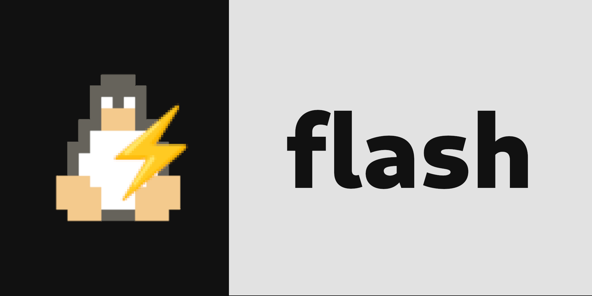

# ⚡flash⚡
A lightweight package manager for managing GitHub-based packages. Install, list, remove, and update packages with ease directly from the command line.


## Usage

Flash supports the following commands:

- **Install a Package**: `-S <github_user>/<repo>`
- **List cloned Packages**: `-L`
- **Remove a Package**: `-R <package>`
- **Update a Package**: `-U <package>`
- **Update All Installed Packages**: `-UA`


# Package template:

- `exec`: Specifies the installation command for the package.
- `name`: Provides the name of the package.
- `desc`: Offers a brief description of the package.
- `clear=true/false`: Indicates whether the cloned package directory should be removed after installation.
## Example:
```
exec=make install
name=flash
desc=A lightweight package manager for managing GitHub-based packages. Install, list, remove, and update packages with ease directly from the command line.
clear=true
```


